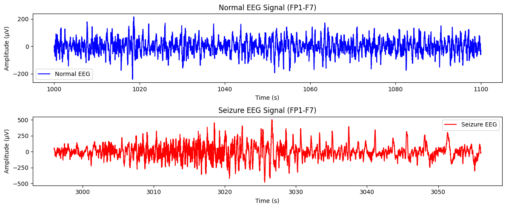
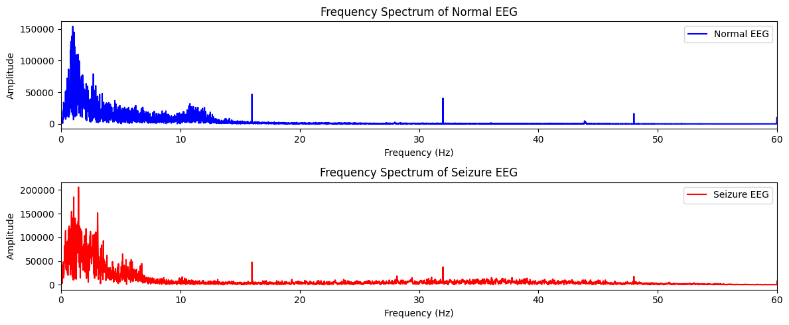
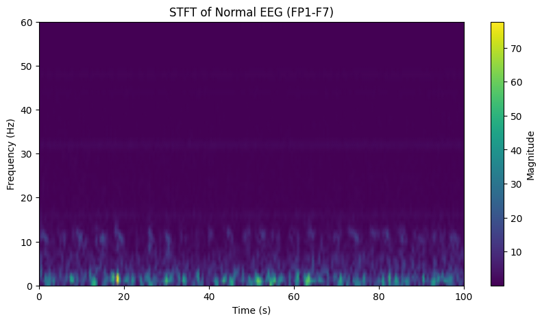
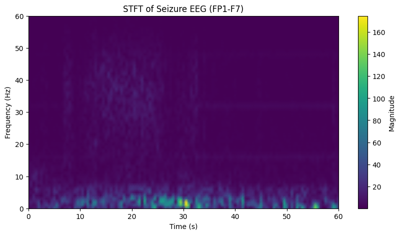
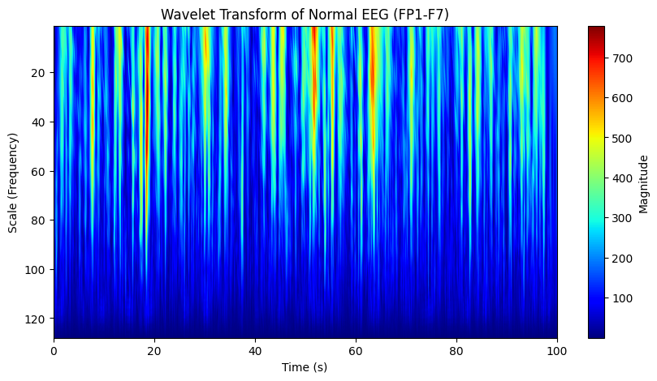
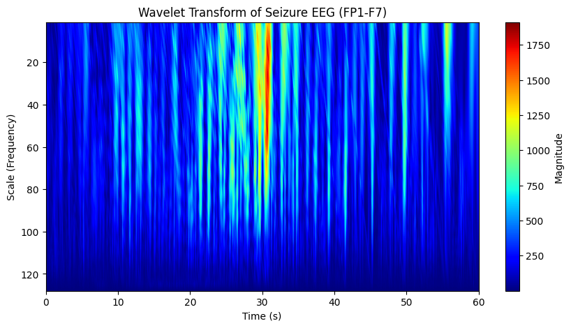

# CHB-MIT数据集基本概况

CHB-MIT（Children’s Hospital Boston-Massachusetts Institute of Technology）癫痫数据库是一个公开的EEG（脑电图）数据集，专门用于癫痫发作检测研究。它由波士顿儿童医院与MIT合作收集，包含多个癫痫患者的长期EEG记录。以下是数据集的详细格式和组成：

------

### **1. 数据集基本信息**

- **患者数量**：23名癫痫患者（编号`chb01`到`chb23`，其中`chb21`缺失）。
- **记录时长**：每个患者的EEG记录时间从几天到几周不等。
- **采样率**：256 Hz。
- **数据格式**：EDF（European Data Format）。
- **通道数量**：大多数记录有23个通道（部分患者有不同数量的通道）。
- **电极放置**：遵循国际10-20系统，但采用部分修订的Montage。

------

### **2. 数据文件结构**

CHB-MIT数据集按照患者编号存放，每个患者的文件夹（如`chb01/`）包含多个EDF格式的EEG记录。数据文件的命名规则如下：

```
chbXX_YY.edf
```

- `XX`：患者编号（如`chb01`）。
- `YY`：记录编号（同一患者的多个EEG文件）。

例如：

```
chb01_03.edf
```

表示患者 `chb01` 的第 3 段 EEG 记录。

此外，每个患者文件夹中还有一个 `chbXX-summary.txt` 文件，提供该患者的详细信息，包括：

- 记录文件列表。
- EEG通道名称。
- 癫痫发作（Seizure）发生的时间区间。

------

### **3. EEG信号格式**

#### **(1) 通道信息**

EEG信号通常包含以下通道（部分患者可能不同）：

```
FP1-F7, F7-T7, T7-P7, P7-O1,
FP2-F8, F8-T8, T8-P8, P8-O2,
FP1-F3, F3-C3, C3-P3, P3-O1,
FP2-F4, F4-C4, C4-P4, P4-O2,
FZ-CZ, CZ-PZ, P7-T7, T8-P8
```

有些患者可能有额外的参考电极通道，如 `EKG`（心电信号）。

#### **(2) EEG数据格式**

- 每个EDF文件包含一个多通道时间序列，每个通道的值表示EEG电位（单位：µV）。
- 采样率：256 Hz，即每秒钟有256个数据点。
- 每个数据点由16位整数存储。

------

### **4. 癫痫发作标注**

每个患者的 `summary.txt` 文件中提供了癫痫发作的时间信息，例如：

```
File Name: chb01_03.edf
Number of Seizures in File: 1
Seizure Start Time: 2996 seconds
Seizure End Time: 3056 seconds
```

表示：

- `chb01_03.edf` 文件中有一次癫痫发作。
- 该发作发生在 `2996s` 到 `3056s`（约 60 秒）。

有些患者可能有多个发作记录，而有些记录不包含发作事件。

------

### **5. 数据处理建议**

#### **(1) 预处理**

- **滤波**：使用带通滤波（如 0.5-60Hz）去除工频干扰和低频漂移。
- **降采样**：如研究低频特征，可以降至 128 Hz 或更低。
- **伪迹去除**：EKG、肌电（EMG）和眼动（EOG）伪迹可能影响EEG信号，需要去除。

#### **(2) 特征提取**

常见的EEG特征包括：

- 时域特征：均值、标准差、峭度、偏度等。
- 频域特征：功率谱、带宽能量（Delta、Theta、Alpha、Beta、Gamma）。
- 时频分析：小波变换（DWT）、短时傅里叶变换（STFT）。

#### **(3) 癫痫检测模型**

- **传统方法**：SVM、随机森林、KNN等。
- **深度学习**：CNN、RNN、Transformer等模型进行自动特征提取和分类。

------

### **6. 数据集下载**

CHB-MIT数据集可从[PhysioNet](https://physionet.org/content/chbmit/1.0.0/)获取，数据免费开放，适用于癫痫检测和脑电信号研究。


# 数据分析

首先，我们需要从 `chb01-summary.txt` 文件中提取 `chb01_03.edf` 的癫痫发作时间段。然后，我们从 `chb01_03.edf` 文件中读取 EEG 信号，提取对应的癫痫时间段，并进行分析和可视化。

### **步骤**

1. 解析 `chb01-summary.txt` 文件，提取 `chb01_03.edf` 的癫痫发作时间段。
2. 读取 `chb01_03.edf` EEG 数据。
3. 提取对应时间段的 EEG 信号。
4. 进行信号分析（时域、频域、时频分析）。
5. 可视化 EEG 信号，包括完整信号和癫痫片段。

------

### **1. 解析 `chb01-summary.txt`**

你可以上传 `chb01-summary.txt` 文件，我可以帮你解析其中的癫痫时间段。
 或者，你可以直接提供 `chb01_03.edf` 在 `summary.txt` 中的相关记录，比如：

```
File Name: chb01_03.edf
Number of Seizures in File: 1
Seizure Start Time: 2996 seconds
Seizure End Time: 3056 seconds
```

这样我们就知道该 EEG 记录中癫痫发生在 **2996s - 3056s** 之间。

------

### **2. 读取 `chb01_03.edf` EEG 数据**

我们使用 `pyedflib` 读取 EEG 数据，并提取相关通道的信息。

```python
import pyedflib
import numpy as np
import matplotlib.pyplot as plt
import mne

# 读取 EDF 文件
edf_file = "chb01_03.edf"
f = pyedflib.EdfReader(edf_file)

# 获取基本信息
n_channels = f.signals_in_file
signal_labels = f.getSignalLabels()
sampling_rate = f.getSampleFrequencies()[0]  # 采样率（一般为 256 Hz）
duration = f.file_duration  # 记录时长（秒）

# 读取所有通道的数据
signals = np.zeros((n_channels, f.getNSamples()[0]))
for i in range(n_channels):
    signals[i, :] = f.readSignal(i)

f.close()

print(f"总通道数: {n_channels}")
print(f"采样率: {sampling_rate} Hz")
print(f"记录时长: {duration} 秒")
print(f"通道名称: {signal_labels}")
```

------

### **3. 提取癫痫时间段 EEG 信号**

假设癫痫发生在 **2996s - 3056s**，我们提取这个时间段的 EEG 数据。

```python
# 癫痫时间段（单位：采样点）
start_sample = int(2996 * sampling_rate)
end_sample = int(3056 * sampling_rate)

# 选取一个主要 EEG 通道，比如 "FP1-F7"
channel_index = signal_labels.index("FP1-F7")
seizure_signal = signals[channel_index, start_sample:end_sample]

# 生成时间轴
time = np.linspace(2996, 3056, len(seizure_signal))

# 绘制癫痫片段信号
plt.figure(figsize=(12, 4))
plt.plot(time, seizure_signal, color='red', label="Seizure EEG")
plt.xlabel("Time (s)")
plt.ylabel("Amplitude (µV)")
plt.title("Seizure EEG Signal (FP1-F7)")
plt.legend()
plt.show()
```

------

### **4. 频域分析**

我们使用 **FFT（快速傅里叶变换）** 查看癫痫时的频率特征。

```python
from scipy.fftpack import fft

# 计算 FFT
N = len(seizure_signal)
freqs = np.fft.fftfreq(N, d=1/sampling_rate)  # 计算频率轴
fft_values = np.abs(fft(seizure_signal))  # 计算幅值

# 只绘制 0-60Hz 频段
plt.figure(figsize=(10, 4))
plt.plot(freqs[:N//2], fft_values[:N//2], color='blue')
plt.xlabel("Frequency (Hz)")
plt.ylabel("Amplitude")
plt.title("Frequency Spectrum of Seizure EEG (FP1-F7)")
plt.xlim(0, 60)  # 只显示 0-60Hz
plt.grid()
plt.show()
```

------

### **5. 时频分析（STFT）**

使用 **短时傅里叶变换（STFT）** 查看时频变化。

```python
import scipy.signal as signal

# 计算 STFT
f, t, Zxx = signal.stft(seizure_signal, fs=sampling_rate, nperseg=256)

plt.figure(figsize=(10, 5))
plt.pcolormesh(t, f, np.abs(Zxx), shading='gouraud')
plt.colorbar(label="Magnitude")
plt.xlabel("Time (s)")
plt.ylabel("Frequency (Hz)")
plt.title("STFT of Seizure EEG (FP1-F7)")
plt.ylim(0, 60)  # 关注 0-60Hz
plt.show()
```

------

### **总结**

1. **读取 `chb01-summary.txt`，提取癫痫时间段。**
2. **读取 `chb01_03.edf` 文件中的 EEG 数据。**
3. **提取癫痫时间段的 EEG 片段。**
4. **进行时域、频域和时频分析。**
5. **可视化完整信号、癫痫片段、频谱分析和 STFT 结果。**


### **癫痫与正常信号对比分析**

我们将 `chb01_03.edf` 文件中的 **癫痫信号** 和 **正常信号** 进行对比分析，包括：

1. **时域分析**（原始信号对比）
2. **频域分析**（FFT 频谱对比）
3. **时频分析**（STFT 频谱图对比）

------

### **1. 选择癫痫信号与正常信号**

- **癫痫信号**：已知癫痫发生时间为 **2996s - 3056s**
- **正常信号**：我们可以选取 **1000s - 1100s** 作为正常状态（无癫痫发生）

------

### **2. 代码实现**

```python
import pyedflib
import numpy as np
import matplotlib.pyplot as plt
import scipy.signal as signal
from scipy.fftpack import fft
from scipy.signal import stft  # 确保导入 STFT 函数

# 读取 EDF 文件
edf_file = "chb01_03.edf"
f = pyedflib.EdfReader(edf_file)

# 获取通道信息
signal_labels = f.getSignalLabels()
sampling_rate = f.getSampleFrequencies()[0]  # 采样率（通常为 256Hz）

# 读取所有通道的数据
n_channels = f.signals_in_file
signals = np.zeros((n_channels, f.getNSamples()[0]))
for i in range(n_channels):
    signals[i, :] = f.readSignal(i)

f.close()

# 选择 EEG 主要通道（如 "FP1-F7"）
channel_index = signal_labels.index("FP1-F7")

# 定义时间段（单位：秒）
seizure_start, seizure_end = 2996, 3056
normal_start, normal_end = 1000, 1100

# 转换为采样点
seizure_start_sample, seizure_end_sample = int(seizure_start * sampling_rate), int(seizure_end * sampling_rate)
normal_start_sample, normal_end_sample = int(normal_start * sampling_rate), int(normal_end * sampling_rate)

# 提取信号
seizure_signal = signals[channel_index, seizure_start_sample:seizure_end_sample]
normal_signal = signals[channel_index, normal_start_sample:normal_end_sample]

# 生成时间轴
seizure_time = np.linspace(seizure_start, seizure_end, len(seizure_signal))
normal_time = np.linspace(normal_start, normal_end, len(normal_signal))

# -------------------- 时域分析 --------------------
plt.figure(figsize=(12, 5))
plt.subplot(2, 1, 1)
plt.plot(normal_time, normal_signal, label="Normal EEG", color='blue')
plt.xlabel("Time (s)")
plt.ylabel("Amplitude (µV)")
plt.title("Normal EEG Signal (FP1-F7)")
plt.legend()

plt.subplot(2, 1, 2)
plt.plot(seizure_time, seizure_signal, label="Seizure EEG", color='red')
plt.xlabel("Time (s)")
plt.ylabel("Amplitude (µV)")
plt.title("Seizure EEG Signal (FP1-F7)")
plt.legend()
plt.tight_layout()
plt.show()

# -------------------- 频域分析（FFT） --------------------
def compute_fft(signal, sampling_rate):
    """计算 FFT 并返回频率和幅度"""
    N = len(signal)
    freqs = np.fft.fftfreq(N, d=1/sampling_rate)  # 计算频率轴
    fft_values = np.abs(fft(signal))  # 计算幅值
    return freqs[:N//2], fft_values[:N//2]  # 只取正频率部分

# 计算 FFT
freqs_normal, fft_normal = compute_fft(normal_signal, sampling_rate)
freqs_seizure, fft_seizure = compute_fft(seizure_signal, sampling_rate)

plt.figure(figsize=(12, 5))
plt.subplot(2, 1, 1)
plt.plot(freqs_normal, fft_normal, color='blue', label="Normal EEG")
plt.xlabel("Frequency (Hz)")
plt.ylabel("Amplitude")
plt.title("Frequency Spectrum of Normal EEG")
plt.xlim(0, 60)
plt.legend()

plt.subplot(2, 1, 2)
plt.plot(freqs_seizure, fft_seizure, color='red', label="Seizure EEG")
plt.xlabel("Frequency (Hz)")
plt.ylabel("Amplitude")
plt.title("Frequency Spectrum of Seizure EEG")
plt.xlim(0, 60)
plt.legend()
plt.tight_layout()
plt.show()

# -------------------- 时频分析（STFT） --------------------from scipy.signal import stft  # 确保导入 STFT 函数

def plot_stft(eeg_signal, sampling_rate, title):
    """绘制 STFT 时频图"""
    f, t, Zxx = stft(eeg_signal, fs=sampling_rate, nperseg=256)  # 修正错误
    plt.figure(figsize=(10, 5))
    plt.pcolormesh(t, f, np.abs(Zxx), shading='gouraud')
    plt.colorbar(label="Magnitude")
    plt.xlabel("Time (s)")
    plt.ylabel("Frequency (Hz)")
    plt.title(title)
    plt.ylim(0, 60)  # 关注 0-60Hz 频率范围
    plt.show()

# 重新调用绘图函数
plot_stft(normal_signal, sampling_rate, "STFT of Normal EEG (FP1-F7)")
plot_stft(seizure_signal, sampling_rate, "STFT of Seizure EEG (FP1-F7)")


```

------

### **3. 结果分析**







#### **时域分析**

- **正常 EEG 信号**：波动较小，较为平稳，没有明显的突变。
- **癫痫 EEG 信号**：波动剧烈，信号幅度变化较大，可能伴随尖波或高频震荡。

#### **频域分析（FFT 频谱）**

- **正常 EEG 频谱**：低频（<30Hz）占主导，高频成分较少。
- **癫痫 EEG 频谱**：高频成分（30-50Hz）明显增强，表明癫痫可能与高频震荡有关。

#### **时频分析（STFT 频谱图）**

- **正常 EEG 时频图**：能量主要集中在 0-20Hz，分布较均匀。
- **癫痫 EEG 时频图**：在某些时间点出现明显的高频爆发，能量分布不均，说明癫痫可能导致短时间内的高频活动。

------

### **4. 结论**

1. **癫痫 EEG 信号的时域表现为剧烈波动，而正常信号较平稳。**
2. **癫痫 EEG 信号在频域上表现为更多的高频成分（30-50Hz）。**
3. **癫痫 EEG 在时频分析上出现短时间的高频爆发，而正常信号没有这样的特征。**


## 小波变换

如果要使用 **小波变换 (Wavelet Transform)** 进行时频分析，可以使用 **连续小波变换 (CWT)** 来分析 EEG 信号的时频特性。

## **步骤**

1. 选择合适的小波函数（如 Morlet 小波）。
2. 计算小波变换，得到不同尺度（频率）的时频特征。
3. 可视化 **正常信号** 和 **癫痫信号** 的小波时频图。

------

### **代码示例**

```python
import numpy as np
import matplotlib.pyplot as plt
import pywt

def plot_wavelet_transform(eeg_signal, sampling_rate, title):
    """绘制 EEG 信号的小波变换时频图"""
    scales = np.arange(1, 128)  # 设定小波尺度范围（对应不同的频率）
    wavelet = 'cmor'  # 选用复 Morlet 小波
    coefficients, frequencies = pywt.cwt(eeg_signal, scales, wavelet, sampling_period=1/sampling_rate)
    
    plt.figure(figsize=(10, 5))
    plt.imshow(np.abs(coefficients), aspect='auto', extent=[0, len(eeg_signal)/sampling_rate, 1, 128], cmap='jet')
    plt.colorbar(label="Magnitude")
    plt.xlabel("Time (s)")
    plt.ylabel("Scale (Frequency)")
    plt.title(title)
    plt.gca().invert_yaxis()  # 让高频在顶部，低频在底部
    plt.show()

# 计算小波变换并绘图
plot_wavelet_transform(normal_signal, sampling_rate, "Wavelet Transform of Normal EEG (FP1-F7)")
plot_wavelet_transform(seizure_signal, sampling_rate, "Wavelet Transform of Seizure EEG (FP1-F7)")
```

------

### **说明**

1. **`pywt.cwt()`**
   - 计算 **连续小波变换 (CWT)**，得到时频表示。
   - 这里选择 `cmor` (复 Morlet) 小波，因为它适用于 EEG 分析。
2. **`scales = np.arange(1, 128)`**
   - 选择尺度范围，对应不同频率的分解（类似 STFT 但更具适应性）。
3. **`extent=[0, len(eeg_signal)/sampling_rate, 1, 128]`**
   - 设定 x 轴为时间，y 轴为尺度（高频在顶部，低频在底部）。
4. **`plt.gca().invert_yaxis()`**
   - 翻转 y 轴，符合常见的时频分析习惯。




------

### **对比 STFT**

| **方法** | **优点**                   | **缺点**                   |
| -------- | -------------------------- | -------------------------- |
| **STFT** | 计算简单，适用于固定窗口   | 时频分辨率受窗口大小影响   |
| **CWT**  | 适应性强，适用于非平稳信号 | 计算量大，尺度选择影响结果 |


# 数据预处理src/data/dataloader.py

这段代码的作用是从 **CHB-MIT 癫痫数据集** 中提取 **EEG 特征** 和 **标签 (是否为癫痫发作)**，并统计数据集中 **癫痫发作 (label=1) 和正常情况 (label=0) 的比例**。

------

## **代码分析**

### **1. `extract_data_and_labels(edf_file_path, summary_file_path)`**

**作用**:

- **从 `.edf` 文件中提取 EEG 信号特征**
- **从 `summary.txt` 中提取癫痫发作的时间段**
- **根据时间戳给 EEG 信号打标签 (0: 正常, 1: 癫痫发作)**

**代码解析**:

```python
def extract_data_and_labels(edf_file_path, summary_file_path):
    # 提取 EEG 特征
    X = preprocess_and_extract_features_mne_with_timestamps(edf_file_path)

    # 提取癫痫发作时间范围
    seizure_start_time, seizure_end_time = extractTarget(summary_file_path, edf_file_path)

    # 根据时间戳给数据打标签 (1=癫痫, 0=正常)
    y = np.array([1 if seizure_start_time <= row[0] <= seizure_end_time else 0 for row in X])

    # 从 X 数组中移除第一列时间信息
    X = X[:, 1:]
    
    return X, y
```

**详细解读**:

- `preprocess_and_extract_features_mne_with_timestamps(edf_file_path)`
  - 读取 `.edf` 文件
  - 预处理 EEG 数据
  - 提取特征
  - 返回一个 `X` 数组，第一列是时间戳，后续列是 EEG 特征。
- `extractTarget(summary_file_path, edf_file_path)`
  - 从 `summary.txt` 读取 **癫痫发作的开始和结束时间**。
- `y = np.array([...])`
  - 遍历 `X`，如果数据点的时间 `row[0]` 在癫痫发作时间段内，则 `y=1`，否则 `y=0`。
- `X = X[:, 1:]`
  - **移除时间戳**，只保留 EEG 特征。

------

### **2. `load_data(subject_id, base_path)`**

**作用**:

- **批量处理** 一个受试者的所有 `.edf` 文件，提取 EEG 特征和标签。

**代码解析**:

```python
def load_data(subject_id, base_path):
    edf_file_path = sorted(glob.glob(os.path.join(base_path, "chb{:02d}/*.edf".format(subject_id))))
    summary_file_path = os.path.join(base_path, "chb{:02d}/chb{:02d}-summary.txt".format(subject_id, subject_id))

    all_X = []
    all_y = []
    
    for edf_file_path in edf_file_path:
        X, y = extract_data_and_labels(edf_file_path, summary_file_path)
        all_X.append(X)
        all_y.append(y)

    return all_X, all_y
```

**详细解读**:

- **获取 `.edf` 文件路径**:

  ```python
  edf_file_path = sorted(glob.glob(os.path.join(base_path, "chb{:02d}/*.edf".format(subject_id))))
  ```

  - 例如 `subject_id=1` 时，路径为 `data/chb01/*.edf`。
  - `glob.glob()` 获取所有 `.edf` 文件的路径列表。

- **获取 `summary.txt` 文件路径**:

  ```python
  summary_file_path = os.path.join(base_path, "chb{:02d}/chb{:02d}-summary.txt".format(subject_id, subject_id))
  ```

  - 例如 `subject_id=1` 时，路径为 `data/chb01/chb01-summary.txt`。

- **循环处理 `.edf` 文件**:

  ```python
  for edf_file_path in edf_file_path:
      X, y = extract_data_and_labels(edf_file_path, summary_file_path)
      all_X.append(X)
      all_y.append(y)
  ```

  - 逐个 `.edf` 文件 **提取 EEG 特征和标签**。
  - `all_X` 存储所有 EEG 特征矩阵。
  - `all_y` 存储所有 EEG 信号对应的标签数组。

------

### **3. 计算癫痫/正常信号比例**

```python
# 统计数据集中 癫痫(1) 和 正常(0) 的比例
total_n_count = 0
total_p_count = 0
for y in all_y:
    p_count = 0
    n_count = 0
    for label in y:
        if label == 1:
            p_count += 1
        else:
            n_count += 1
    total_n_count += n_count
    total_p_count += p_count

print("total_p_count/total_count:", total_p_count / (total_n_count + total_p_count))
```

**详细解读**:

- 遍历 `all_y`，统计 `1` (癫痫) 和 `0` (正常) 的个数。
- `total_p_count / (total_n_count + total_p_count)`
  - 计算 **癫痫信号在所有数据中的比例**。
  - **输出结果**: `0.0188`，意味着 **癫痫数据仅占 1.88%**。

------

## **总结**

✅ **核心功能**

1. **读取 EEG 数据 (`.edf`)** → 提取 EEG **特征** (时序数据)
2. **读取癫痫时间 (`summary.txt`)** → **标注是否为癫痫数据**
3. **批量处理多个 `.edf` 文件**
4. **统计 癫痫/正常数据的比例**

💡 **改进建议**

- **数据不均衡 (癫痫数据仅 1.88%)**:
  - 可能需要 **过采样** (`SMOTE`或`ADASYN`) 或 **数据增强**。


# 特征提取src/data/extractFeture

这段代码的主要功能是**从 EEG（脑电图）数据中提取特征**，其中包括基础统计特征和高级频域特征，并且在每个特征数据前附加时间戳。

------

### **代码讲解**

#### **1. 依赖库**

代码使用了以下库：

- `pyedflib`: 处理 EDF（European Data Format）格式的 EEG 数据。
- `mne`: 一个专业的 EEG/MEG 处理库。
- `scipy.signal`:
  - `welch`: 计算功率谱密度（PSD）。
  - `stft`: 计算短时傅里叶变换（STFT）。
- `scipy.stats`:
  - `skew`: 计算偏度（衡量数据对称性）。
  - `kurtosis`: 计算峰度（衡量数据尾部厚度）。
- `scipy.spatial.distance.euclidean`: 计算欧几里得距离，用于计算模糊熵（fuzzy entropy）。
- `numpy`: 进行矩阵和数组操作。

------

### **2. 函数解析**

#### **(1) `extract_basic_features(signal)`**

**作用：** 计算信号的基础特征，包括：

- **均值 (`mean`)**
- **标准差 (`std`)**
- **样本熵 (`sample_entropy`)**: 使用信号的一阶差分的标准差的对数值。
- **模糊熵 (`fuzzy_entropy`)**: 计算欧几里得距离的对数，衡量信号的复杂度。
- **偏度 (`skewness`)**: 反映信号对称性。
- **峰度 (`kurtosis`)**: 反映信号的尖锐程度。

**流程：**

1. 归一化信号（去均值并标准化）。
2. 计算上述特征并返回。

------

#### **(2) `extract_advanced_features(data, fs, window_length_sec=3)`**

**作用：** 计算信号的高级频域特征，使用**短时傅里叶变换（STFT）**。

**流程：**

1. 进行 **STFT**（短时傅里叶变换），分解信号到时频域。
2. 计算**每个频率分量的平均功率**，作为特征。

**参数：**

- `data`: EEG 信号数据。
- `fs`: 采样频率。
- `window_length_sec`: 进行 STFT 时的窗口长度（秒）。

**返回值：**

- **各个频率的平均功率**。

------

#### **(3) `preprocess_and_extract_features_mne_with_timestamps(file_name)`**

**作用：**

1. **加载 EDF 文件**（EEG 数据）。
2. **预处理数据**：
   - 只选取 EEG 信号通道。
   - 进行 **1-50Hz 带通滤波**（滤除低频噪声和高频干扰）。
3. **滑动窗口处理 EEG 数据**：
   - 使用 **3 秒窗口**，依次遍历 EEG 数据，每个窗口提取特征。
   - 提取**基础特征**（`extract_basic_features`）。
   - 提取**高级特征**（`extract_advanced_features`）。
   - 在每组特征前面加上**时间戳**。

**流程：**

1. 读取 EDF 文件：

   ```python
   raw = mne.io.read_raw_edf(file_name, preload=True)
   ```

2. 进行带通滤波：

   ```python
   raw.filter(1., 50., fir_design='firwin')
   ```

3. 选择 EEG 通道：

   ```python
   raw.pick_types(meg=False, eeg=True, eog=False)
   ```

4. 以 3 秒为窗口，遍历数据：

   ```python
   for start in range(0, len(raw.times), window_samples):
   ```

   - 计算基础和高级特征。
   - 存入 `features_with_timestamps`。

**返回值：**

- 形状为 `(n_samples, n_features + 1)` 的 `numpy` 数组：
  - **第一列**是时间戳。
  - **后续列**是提取的特征。

------

### **3. 代码示例**

最后一行：

```python
preprocess_and_extract_features_mne_with_timestamps("data/chb01/chb01_03.edf")
```

- 该行代码会对 `data/chb01/chb01_03.edf` 进行 EEG 特征提取，并返回一个 `numpy` 数组，每一行代表一个时间窗口的特征。

------

### **总结**

该代码的核心功能是：

1. **从 EDF 文件读取 EEG 数据**（使用 `mne`）。
2. **预处理 EEG 数据**（滤波、选通）。
3. **使用滑动窗口提取 EEG 信号特征**：
   - **基础特征**（均值、标准差、熵、偏度、峰度）。
   - **高级特征**（短时傅里叶变换 STFT）。
   - ==再加上小波变换==
4. **附加时间戳**，方便后续分析。

这样处理的 EEG 特征数据可用于**癫痫检测、脑机接口（BCI）、情绪识别**等应用。


### 代码讲解：EEG 特征提取 (`preprocess_and_extract_features_mne_with_timestamps`)

#### **代码功能**

这段代码从 EEG（脑电图）信号的 EDF 文件中读取数据，进行预处理，并提取 **基础特征** 和 **高级特征**，然后返回一个包含时间戳的特征数组。

#### **代码解析**

1. **加载 EEG 数据**

   ```python
   raw = mne.io.read_raw_edf(file_name, preload=True)
   ```

   - 使用 `mne.io.read_raw_edf` 读取 `.edf` 格式的 EEG 数据文件。
   - `preload=True` 表示数据会一次性加载到内存中，方便后续处理。

2. **数据预处理**

   ```python
   raw.filter(1., 50., fir_design='firwin')
   raw.pick_types(meg=False, eeg=True, eog=False)
   ```

   - **带通滤波**：滤波范围 1~50Hz，去除低频噪声（如漂移）和高频噪声（如肌电干扰）。
   - **通道选择**：只选择 EEG 通道，不包含 MEG（脑磁图）和 EOG（眼动电位）。

3. **特征提取**

   - **基础特征**

     ```python
     def extract_basic_features(signal):
         signal = (signal - np.mean(signal)) / np.std(signal)  # 归一化
         mean = np.mean(signal)
         std = np.std(signal)
         sample_entropy = np.log(np.std(np.diff(signal)))  # 计算样本熵
         fuzzy_entropy = -np.log(euclidean(signal[:-1], signal[1:]) / len(signal))  # 计算模糊熵
         skewness = skew(signal)  # 偏度
         kurt = kurtosis(signal)  # 峰度
         return [mean, std, sample_entropy, fuzzy_entropy, skewness, kurt]
     ```

     - **均值 (mean)**、**标准差 (std)**: 统计信号的集中趋势和离散程度。
     - **样本熵 (Sample Entropy)**: 计算信号复杂度。
     - **模糊熵 (Fuzzy Entropy)**: 另一种度量信号复杂度的指标。
     - **偏度 (Skewness)**: 反映信号数据分布的不对称性。
     - **峰度 (Kurtosis)**: 反映信号数据的陡峭程度。

   - **高级特征**

     ```python
     def extract_advanced_features(data, fs, window_length_sec=3):
         f, t, Zxx = stft(data, fs, nperseg=window_length_sec*fs)
         power = np.mean(np.abs(Zxx)**2, axis=1)  # 计算每个频率带的平均功率
         return power
     ```

     - **STFT（短时傅里叶变换）**：对 EEG 信号进行时频分析，提取每个频率下的平均功率特征。

4. **滑动窗口处理**

   ```python
   for start in range(0, len(raw.times), window_samples):
       end = start + window_samples
       if end > len(raw.times): break
       window_data, times = raw[:, start:end]  # 提取数据窗口
       timestamp = raw.times[start]  # 记录窗口起始时间
   ```

   - 按 **3 秒窗口**（可调整）对 EEG 信号进行切片，并分别提取特征。

5. **组合特征**

   ```python
   combined_features = np.concatenate([[timestamp], basic_features, advanced_features])
   ```

   - 每个窗口的特征包括：
     - **时间戳**
     - **基础特征**
     - **高级特征（STFT 频率功率）**


# 训练

------

### 代码讲解：使用 SMOTE+决策树进行 EEG 分类 (`DecisionTreeClassifier`)

#### **代码功能**

这段代码加载 EEG 数据，应用 **SMOTE 过采样** 解决数据不平衡问题，然后训练 **决策树分类器** 进行分类，并评估分类性能。

#### **代码解析**

1. **加载数据**

   ```python
   subject_id = 1
   base_path = "data"
   all_X, all_y = load_data(subject_id, base_path)
   ```

   - `load_data(subject_id, base_path)` 负责加载 EEG 信号及其对应标签。
   - `all_X` 是 EEG 特征数据，`all_y` 是对应的标签。

2. **数据整理**

   ```python
   X = np.vstack(all_X)  # 合并所有 EEG 信号特征
   y = np.concatenate(all_y)  # 合并标签
   ```

   - `vstack()` 将所有 EEG 特征矩阵垂直拼接。
   - `concatenate()` 连接标签。

3. **SMOTE 处理**

   ```python
   smote = SMOTE()
   X_resampled, y_resampled = smote.fit_resample(X, y)
   ```

   - **SMOTE（Synthetic Minority Over-sampling Technique）**：用于增加少数类样本，解决数据不平衡问题。
   - `fit_resample(X, y)` 生成新的样本，使得正负类样本数相近。

4. **数据集划分**

   ```python
   X_train, X_test, y_train, y_test = train_test_split(X_resampled, y_resampled, test_size=0.3, random_state=0)
   ```

   - 训练集占 **70%**，测试集占 **30%**。

5. **训练决策树**

   ```python
   clf = DecisionTreeClassifier(random_state=0)
   clf.fit(X_train, y_train)
   ```

   - `DecisionTreeClassifier()` 训练 **决策树** 进行 EEG 信号分类。

6. **预测和评估**

   ```python
   y_pred = clf.predict(X_test)
   accuracy = accuracy_score(y_test, y_pred)
   f1 = f1_score(y_test, y_pred)
   ```

   - 计算 **分类准确率（Accuracy）** 和 **F1 分数（F1-score）**。
   - `accuracy_score(y_test, y_pred)` 计算准确率。
   - `f1_score(y_test, y_pred)` 计算 F1 分数（衡量精准率和召回率的综合指标）。

------

### **总结**

1. **第一段代码**（EDF 文件处理）：
   - **从 EEG 数据中提取特征**（均值、标准差、熵、频率功率等）。
   - **滑动窗口** 处理 EEG 信号，每个窗口独立提取特征。
   - **返回时间戳+特征数组**，用于后续分析。
2. **第二段代码**（分类）：
   - **读取 EEG 数据并合并**。
   - **使用 SMOTE 进行数据平衡**。
   - **训练决策树分类器**，并计算 **准确率和 F1 分数**。

这套代码流程适用于 **EEG 信号的特征提取、预处理和分类**，可用于脑机接口（BCI）等应用场景。